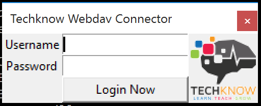

# mounter
Mounter is a simple python Application that will mount the Techknow.io Webdav system, a Techknow user account is required.

Currently Supports Mac OS X And Windows 10

You must have installed:

For All Operating Systems:
python 2.7
and for Windows
pywin32

